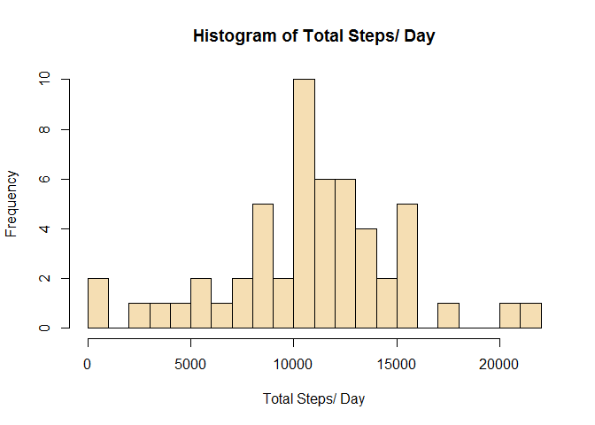
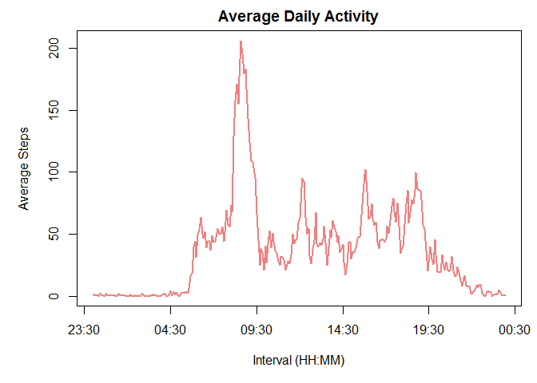
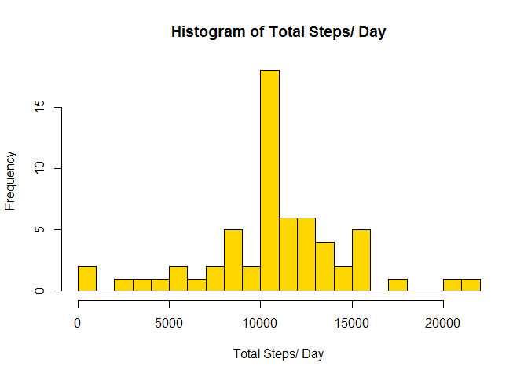
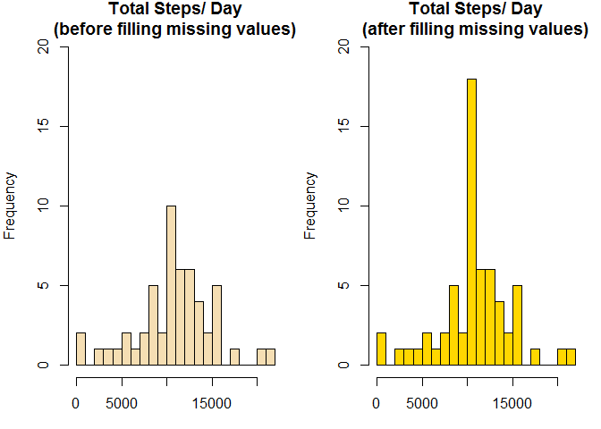
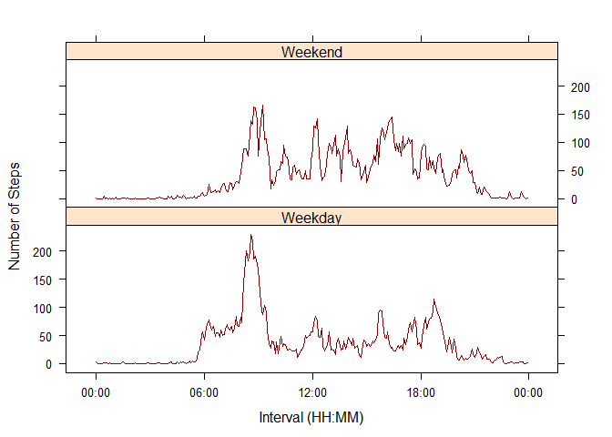

# Reproducible Research: Peer Assessment 1

## Activity monitoring
#### Data Source for this assignment is from [Activity monitoring data](https://d396qusza40orc.cloudfront.net/repdata%2Fdata%2Factivity.zip)

Set the options to echo the code always...

```r
library(stringr)
library(dplyr)
```

```
## 
## Attaching package: 'dplyr'
## 
## The following objects are masked from 'package:stats':
## 
##     filter, lag
## 
## The following objects are masked from 'package:base':
## 
##     intersect, setdiff, setequal, union
```

```r
library(knitr)
opts_chunk$set(echo = TRUE)
```

### Loading and preprocessing the data
#### 1. Load the data (i.e. `read.csv()`)


```r
# download the zip file containing the data into ./data folder and extract its content (activity.csv)
if (!file.exists("./data")) {
    dir.create("./data")
}
activityDataUrl <- "https://d396qusza40orc.cloudfront.net/repdata%2Fdata%2Factivity.zip"
download.file(activityDataUrl, destfile="./data/repdata-data-activity.zip")
activityData <- unzip("./data/repdata-data-activity.zip", exdir = "./data")

# read data
activity <- read.csv(activityData, header = TRUE, na.strings = "NA")
# inspect the structure of read data
str(activity)
```

```
## 'data.frame':	17568 obs. of  3 variables:
##  $ steps   : int  NA NA NA NA NA NA NA NA NA NA ...
##  $ date    : Factor w/ 61 levels "2012-10-01","2012-10-02",..: 1 1 1 1 1 1 1 1 1 1 ...
##  $ interval: int  0 5 10 15 20 25 30 35 40 45 ...
```

```r
nrow(activity)
```

```
## [1] 17568
```

#### 2. Process/transform the data (if necessary) into a format suitable for your analysis

```r
# date column is a factor, let's convert it to date format
activity <- transform(activity, date=as.Date(date))
str(activity)
```

```
## 'data.frame':	17568 obs. of  3 variables:
##  $ steps   : int  NA NA NA NA NA NA NA NA NA NA ...
##  $ date    : Date, format: "2012-10-01" "2012-10-01" ...
##  $ interval: int  0 5 10 15 20 25 30 35 40 45 ...
```

### What is mean total number of steps taken per day?

#### 1. Calculate the total number of steps taken per day


```r
## as per instructions provided, ignore the missing values for this purpose
completeActivity <- complete.cases(activity)

## consider activities that are not NA's
requiredActivity <- activity[completeActivity == TRUE,]
nrow(requiredActivity)
```

```
## [1] 15264
```

```r
## get the activites that are NA's just to cross check and ensure all required activities are considered
naActivity <- activity[completeActivity == FALSE,]
nrow(naActivity)
```

```
## [1] 2304
```

```r
# get the total daily steps
totalDailySteps <- aggregate(steps ~ date, requiredActivity, FUN = sum)
head(totalDailySteps)
```

```
##         date steps
## 1 2012-10-02   126
## 2 2012-10-03 11352
## 3 2012-10-04 12116
## 4 2012-10-05 13294
## 5 2012-10-06 15420
## 6 2012-10-07 11015
```

#### 2. Make a histogram of the total number of steps taken each day

```r
# make a histogram of total number of steps taken each day
hist(totalDailySteps$steps,
     xlab = "Total Steps/ Day",
     main = "Histogram of Total Steps/ Day",
     breaks = 20,
     col="wheat")
```

 


#### 3. Calculate and report the mean and median of the total number of steps taken per day

```r
# get the mean of the daily steps
meanDailySteps <- aggregate(steps ~ date, requiredActivity, FUN = mean)

# get the median of the daily steps
medianDailySteps <- aggregate(steps ~ date, requiredActivity, FUN = median)

# report the mean and median of the total number of steps taken per day
message(paste("Mean of the total number of steps taken per day:", round(mean(totalDailySteps$steps),0)))
```

```
## Mean of the total number of steps taken per day: 10766
```

```r
message(paste("Median of the total number of steps taken per day:", round(median(totalDailySteps$steps),0)))
```

```
## Median of the total number of steps taken per day: 10765
```

### What is the average daily activity pattern?

#### 1. Make a time series plot (i.e. type = "l") of the 5-minute interval (x-axis) and the average number of steps taken, averaged across all days (y-axis)

```r
# get the average daily activity
averageDailyActivity <- aggregate(steps ~ interval, requiredActivity, FUN = mean)
head(averageDailyActivity)
```

```
##   interval     steps
## 1        0 1.7169811
## 2        5 0.3396226
## 3       10 0.1320755
## 4       15 0.1509434
## 5       20 0.0754717
## 6       25 2.0943396
```

```r
# zero pad the interval to have a width of 4 characters
averageDailyActivity$interval <- str_pad(averageDailyActivity$interval, width = 4, side = "left", pad = "0")

# convert the average daily activity into POSIXlt format to represent as calander dates and times
averageDailyActivity$interval <- strptime(averageDailyActivity$interval, format = "%H%M")

# prepare the plot area - 1 row by 1 col with margins 5, 5, 2, 1
par(mfrow = c(1,1), mar=c(5, 5, 2, 1))

# make a time series plot
plot(averageDailyActivity$interval,averageDailyActivity$steps,
     type = "l",
     col = "lightcoral",
     xlab = "Interval (HH:MM)",
     ylab = "Average Steps",
     main = "Average Daily Activity",
     lwd = 2)
```

 

#### 2. Which 5-minute interval, on average across all the days in the dataset, contains the maximum number of steps?

```r
# get the interval at which containing the maximum number of steps and format it
maxFiveMinInterval <- averageDailyActivity[which.max(averageDailyActivity$steps), "interval"] %>% format("%X")

# get the number of steps during that interval
maxStepsDuringMaxFiveMinInterval <- averageDailyActivity[which.max(averageDailyActivity$steps), "steps"] %>% round(0)

# report the max interval and the number of steps during that interval
message(paste("The 5-minute interval, on average across all days that contains the maximum number of steps falls at", maxFiveMinInterval,
              "with", maxStepsDuringMaxFiveMinInterval, "steps"))
```

```
## The 5-minute interval, on average across all days that contains the maximum number of steps falls at 8:35:00 AM with 206 steps
```


### Imputing missing values
#### 1. Calculate and report the total number of missing values in the dataset (i.e. the total number of rows with NAs)

```r
## get the activites that are NA's
naActivity <- activity[completeActivity == FALSE,]

# report the total number of missing values in the dataset
message(paste("The total number of missing values in the dataset is", nrow(naActivity)))
```

```
## The total number of missing values in the dataset is 2304
```

#### 2. Devise a strategy for filling in all of the missing values in the dataset. The strategy does not need to be sophisticated. For example, you could use the mean/median for that day, or the mean for that 5-minute interval, etc.

```r
naActivityNew <- aggregate(steps ~ interval, requiredActivity, FUN = mean)
naActivityNewSteps <- naActivityNew$steps
```

#### 3. Create a new dataset that is equal to the original dataset but with the missing data filled in.

```r
# use conditnioal element selection using ifelse -  ifelse returns a value with the same shape filled with elements selected from either yes or no depending on whether the element of test is TRUE or FALSE
# we will use the original activity data frame for this purpose which contains all rows including NA's
activityNew <- activity %>% transform(steps = ifelse(is.na(activity$steps), naActivityNewSteps, activity$steps))

# validate that we don't have any NA values
completeActivityNew <- complete.cases(activityNew)
naActivityNew <- activityNew[completeActivityNew == FALSE,]

message(paste("After imputing missing values, the number of records with missing values is", nrow(naActivityNew)))
```

```
## After imputing missing values, the number of records with missing values is 0
```

```r
# as a quick sample, review a random part of the contents of the initial activity dataset (as loaded) and new activity dataset
slice(activity, 100:110)
```

```
##    steps       date interval
## 1     NA 2012-10-01      815
## 2     NA 2012-10-01      820
## 3     NA 2012-10-01      825
## 4     NA 2012-10-01      830
## 5     NA 2012-10-01      835
## 6     NA 2012-10-01      840
## 7     NA 2012-10-01      845
## 8     NA 2012-10-01      850
## 9     NA 2012-10-01      855
## 10    NA 2012-10-01      900
## 11    NA 2012-10-01      905
```

```r
slice(activityNew, 100:110)
```

```
##       steps       date interval
## 1  157.5283 2012-10-01      815
## 2  171.1509 2012-10-01      820
## 3  155.3962 2012-10-01      825
## 4  177.3019 2012-10-01      830
## 5  206.1698 2012-10-01      835
## 6  195.9245 2012-10-01      840
## 7  179.5660 2012-10-01      845
## 8  183.3962 2012-10-01      850
## 9  167.0189 2012-10-01      855
## 10 143.4528 2012-10-01      900
## 11 124.0377 2012-10-01      905
```

#### 4. Make a histogram of the total number of steps taken each day and Calculate and report the mean and median total number of steps taken per day. Do these values differ from the estimates from the first part of the assignment? What is the impact of imputing missing data on the estimates of the total daily number of steps?

```r
# get the total daily steps using the new activity dataset
totalDailyStepsNew <- aggregate(steps ~ date, activityNew, FUN = sum)
head(totalDailyStepsNew)
```

```
##         date    steps
## 1 2012-10-01 10766.19
## 2 2012-10-02   126.00
## 3 2012-10-03 11352.00
## 4 2012-10-04 12116.00
## 5 2012-10-05 13294.00
## 6 2012-10-06 15420.00
```

```r
# make a histogram of total number of steps taken each day using this new dataset
hist(totalDailyStepsNew$steps,
     xlab = "Total Steps/ Day",
     main = "Histogram of Total Steps/ Day",
     breaks = 20,
     col="gold")
```

 

```r
# get the mean of the daily steps for the new actitity dataset
meanDailyStepsNew <- aggregate(steps ~ date, activityNew, FUN = mean)

# get the median of the daily steps for the new actitity dataset
medianDailyStepsNew <- aggregate(steps ~ date, activityNew, FUN = median)

# report the mean and median of the total number of steps taken per day
message(paste("Mean of the total number of steps taken per day:", round(mean(totalDailyStepsNew$steps),0)))
```

```
## Mean of the total number of steps taken per day: 10766
```

```r
message(paste("Median of the total number of steps taken per day:", round(median(totalDailyStepsNew$steps),0)))
```

```
## Median of the total number of steps taken per day: 10766
```

```r
# once the NA values were replaced with mean values using the non NA data, the mean and the median are exactly same now

# prepare the plot area - 1 row by 1 col with margins 5, 5, 2, 1
par(mfrow = c(1,2), mar=c(3, 4, 2, 1))

hist(totalDailySteps$steps,
     xlab = "Total Steps/ Day",
     main = "Total Steps/ Day\n(before filling missing values)",
     breaks = 20,
     ylim = c(0, 20),
     col="wheat")

hist(totalDailyStepsNew$steps,
     xlab = "Total Steps/ Day",
     main = "Total Steps/ Day\n(after filling missing values)",
     breaks = 20,
     ylim = c(0, 20),
     col="gold")
```

 


### Are there differences in activity patterns between weekdays and weekends?
#### 1. Create a new factor variable in the dataset with two levels - "weekday" and "weekend" indicating whether a given date is a weekday or weekend day.

```r
# create a new column for identifying the day type -- Weekend or Weekday and get this value and store it
activityNew <- mutate(activityNew, daytype = ifelse(weekdays(date) %in% c("Saturday", "Sunday"), "Weekend", "Weekday"))

# convert the newly created variable from character to a factor variable - this will be used to plot later on
activityNew$daytype <- as.factor((activityNew$daytype))

# get the mean of the daily steps by day type
activityNewByDayType <- aggregate(steps ~ interval + daytype, activityNew, FUN = mean)

# zero pad the interval to have a width of 4 characters
activityNewByDayType$interval <- str_pad(activityNewByDayType$interval, width = 4, side = "left", pad = "0")

# convert the average daily activity into POSIXlt format to represent as calander dates and times
activityNewByDayType$interval <- strptime(activityNewByDayType$interval, format = "%H%M")
#activityNewByDayType$interval
```

#### 2. Make a panel plot containing a time series plot (i.e. type = "l") of the 5-minute interval (x-axis) and the average number of steps taken, averaged across all weekday days or weekend days (y-axis). See the README file in the GitHub repository to see an example of what this plot should look like using simulated data.

```r
# convert to POSIXct to display the x scales later in the plot
activityNewByDayType$interval <- as.POSIXct(activityNewByDayType$interval)

library(lattice)

# prepare the plot area with margins 5, 5, 2, 1
par(mar=c(5, 5, 2, 1))

# make a panel plot using panels for Weekend and Weekday
xyplot(steps ~ interval | daytype, data = activityNewByDayType,
       scales=list(x=list(format = "%H:%M")),
       type = "l",
       col = "darkred",
       layout = c(1, 2),
       ylab = "Number of Steps",
       xlab = "Interval (HH:MM)",
       lwd = 1.5)
```

 

### Report
#### As seen from the panel plot, the activity levels are quite different between Weekend and Weekdays. Around 8:00 am to 9:00 am the activity level looks somewhat comparable. During weekdays, the activity level starts just before 6:00 am. However, during weekends, the activity starts a little later. Overall, on weekdays, the activity level peaks around 8:30 am and then becomes kind of moderate through out the day. The average level of activities througout the day on weekdays is lower compared to weekends for the same, comparable time period of the day. Though the activity starts a bit later on weekends, the overall activity level is generally higher all through the day possibly indicating that the subject moves around (perhaps due to sports and entertainment activities) and does not happen to sit and work (from a particular place) with less movement.
